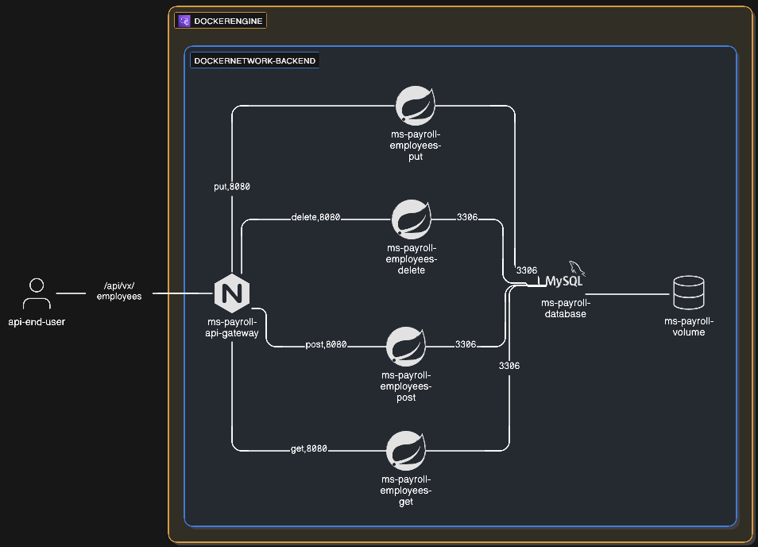

# Project

## Introduction

This project is dedicated to learning how to deploy a microservices-type application, involving an API gateway, various business microservices, and an isolated database on a third party.

Here is a visual representation of the infrastructure:



---

## How to deploy the app

### Set env variable

Copy, paste and rename the sample.env in .env and update the value as expected.

### Normal operation

* Create all images

```dockerfile
docker compose build
```

Note : The initial build may take several minutes !

```bash
// expected result
[+] Building 10/10oll-employees-put     Built      258.0s 
 ✔ Service ms-payroll-employees-post    Built      247.4s 
 ✔ Service ms-payroll-employees-delete  Built      258.1s 
 ✔ Service ms-payroll-employees-get     Built      258.5s 
 ✔ Service ms-payroll-employees-put     Built      258.0s 
 ✔ Service ms-payroll-api-gateway       Built        9.6s 
 ✔ ms-payroll-api-gateway               Built        0.0s 
 ✔ ms-payroll-employees-delete          Built        0.0s 
 ✔ ms-payroll-employees-get             Built        0.0s 
 ✔ ms-payroll-employees-post            Built        0.0s 
 ✔ ms-payroll-employees-put             Built        0.0s 
```

```bash
//docker images
IMAGE                                        ID             DISK USAGE   CONTENT SIZE   EXTRA
eclipse-temurin:17-jre                       12c0683d3468        263MB             0B
maven:3.9.5-eclipse-temurin-17               6bcf649e18aa        481MB             0B
nginx:alpine                                 04da2b0513cd       53.7MB             0B
payroll-ms-payroll-api-gateway:latest        8abb09763d63       53.7MB             0B
payroll-ms-payroll-employees-delete:latest   5ba07646992b        315MB             0B
payroll-ms-payroll-employees-get:latest      b197a0780f33        315MB             0B
payroll-ms-payroll-employees-post:latest     84b01d37ce7f        315MB             0B
payroll-ms-payroll-employees-put:latest      4553dface251        315MB             0B
```

* Start the infra

```dockerfile
docker compose up -d
```

```
//expected result
[+] Running 6/6
 ✔ Container ms-payroll-database          Healthy     6.4s 
 ✔ Container ms-payroll-employees-delete  Healthy    21.6s 
 ✔ Container ms-payroll-employees-put     Healthy    21.6s 
 ✔ Container ms-payroll-employees-post    Healthy    21.6s 
 ✔ Container ms-payroll-employees-get     Healthy    21.6s 
 ✔ Container ms-payroll-api-gateway       Started     0.3s 
```

```
//expected container state
//docker ps -a
[...]
CONTAINER ID   IMAGE                                 COMMAND                  CREATED         STATUS                   PORTS                                 NAMES
1719e808073a   payroll-ms-payroll-api-gateway        "/docker-entrypoint.…"   3 minutes ago   Up 2 minutes (healthy)   0.0.0.0:80->80/tcp, [::]:80->80/tcp   ms-payroll-api-gateway
551fd210fe4b   payroll-ms-payroll-employees-post     "java -jar app.jar"      3 minutes ago   Up 3 minutes (healthy)   8080/tcp                              ms-payroll-employees-post
8b02e0a89889   payroll-ms-payroll-employees-delete   "java -jar app.jar"      3 minutes ago   Up 3 minutes (healthy)   8080/tcp                              ms-payroll-employees-delete
73ce09bf2e43   payroll-ms-payroll-employees-put      "java -jar app.jar"      3 minutes ago   Up 3 minutes (healthy)   8080/tcp                              ms-payroll-employees-put
4801cb06f035   payroll-ms-payroll-employees-get      "java -jar app.jar"      3 minutes ago   Up 3 minutes (healthy)   8080/tcp                              ms-payroll-employees-get
473f13e9ceec   mysql:8.0                             "docker-entrypoint.s…"   3 minutes ago   Up 3 minutes (healthy)   3306/tcp, 33060/tcp                   ms-payroll-database
```

```
//expected network config
//docker network ls
[...]
27a716e29301   payroll_backend   bridge    local
```

```
//expected volume config
//docker volume ls
[...]
local     payroll_mysql-payroll-data
```

---

## How to test the app

* Get all employees (without employees in database)

```
curl -X GET localhost/api/v1/employees
```

```
//expected result (no employees)
  % Total    % Received % Xferd  Average Speed   Time    Time     Time  Current
                                 Dload  Upload   Total   Spent    Left  Speed
100     2    0     2    0     0     14      0 --:--:-- --:--:-- --:--:--    14
[]
```

* Hire a new employee

```
curl -i -X POST localhost/api/v1/employees ^
    -H "Content-type:application/json" ^
    -d "{\"name\": \"Russel George\", \"role\": \"gardener\"}"
```

```
HTTP/1.1 201 
Server: nginx/1.29.4
Date: Fri, 02 Jan 2026 10:40:45 GMT
Content-Type: application/json
Transfer-Encoding: chunked
Connection: keep-alive
Location: /api/v1/employees/1

{"id":1,"name":"Russel George","role":"GARDENER"}
```

* "Replace" an existing employee to change is role

```
curl -i -X PUT localhost/api/v1/employees/1 ^
    -H "Content-type:application/json" ^
    -d "{\"name\": \"Russel George\", \"role\": \"f1 driver\"}"
```

```
HTTP/1.1 201 
Server: nginx/1.29.4
Date: Fri, 02 Jan 2026 10:43:40 GMT
Content-Type: application/json
Transfer-Encoding: chunked
Connection: keep-alive

{"id":1,"name":"Russel George","role":"F1 DRIVER"}
```

* Get (again) all employees

```
curl -X GET localhost/api/v1/employees | jq
```

```
 % Total    % Received % Xferd  Average Speed   Time    Time     Time  Current
                                 Dload  Upload   Total   Spent    Left  Speed
100    52    0    52    0     0   1330      0 --:--:-- --:--:-- --:--:--  1333
[
  {
    "id": 1,
    "name": "Russel George",
    "role": "F1 DRIVER"
  }
]
```

* Remove an employee

```
curl -i -X DELETE localhost/api/v1/employees/1
```

```
HTTP/1.1 204 
Server: nginx/1.29.4
Date: Fri, 02 Jan 2026 10:46:01 GMT
Connection: keep-alive
```

* Try to send a request to a microservice that is temporarily down

```
docker compose down ms-payroll-employees-delete
```

```
[+] Running 2/2
 ✔ Container ms-payroll-employees-delete  Removed 
 ! Network payroll_backend                Resource is still in use   
```

```
curl -i -X DELETE localhost/api/v1/employees/1
```

```
HTTP/1.1 503 Service Temporarily Unavailable
Server: nginx/1.29.4
Date: Fri, 02 Jan 2026 11:04:06 GMT
Content-Type: application/json
Content-Length: 51
Connection: keep-alive

{"error":"Payroll service temporarily unavailable"}
```

* Try to use a http verb outside the application scope

```
curl -X OPTIONS localhost
```

```
<html>
<head><title>405 Not Allowed</title></head>
<body>
<center><h1>405 Not Allowed</h1></center>
<hr><center>nginx/1.29.4</center>
</body>
</html>
```

---

## Debug and analysis

###  BuildKit issue (Windows)

#### Symptom

```dockerfile
//issue when attempting to build the infra
NotFound: forwarding Ping: no such job <jobid>
```

#### Resolution

* Hard reset Docker build state

```
docker compose down --remove-orphans
docker builder prune -f
docker system prune -f
```

* Disable BuildKit state and retry

```
set DOCKER_BUILDKIT=0
docker compose build
docker compose up
```

### Check the composer log

```
docker compose logs -f <ms-name>
```

### Build only one microservice

```
docker compose build <microservice-name>
```

### How to test the database connectivity

* Try from a payroll microservice

```
docker exec -it <microservice-name> sh
apt update
apt install -y mysql-client
mysql -h <microservice-name hosting mysql> -u <username> -p<passwd> <database>
```

### How to check manually the health check

* For the api gateway

```
docker exec -it ms-payroll-api-gateway curl http://localhost/health
```

```
curl http://localhost/health
```

```
//result expected
OK
```

* For the business microservices

```
docker exec -it ms-payroll-employees-get curl http://localhost:8080/actuator/health
```

```
curl http://localhost:8080/actuator/health
```

```
//result expected
{"status":"UP","groups":["liveness","readiness"]}
```
